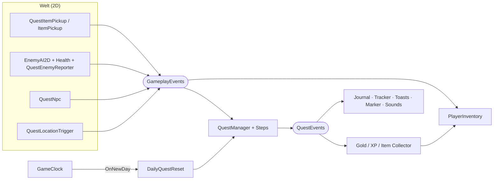

# Steeping Spirits – Architektur

Das Projekt folgt demselben Grundsatz wie Everdawn: **Module kennen sich nicht
direkt, sie reden über Events.** Wer etwas meldet, weiss nicht, wer zuhört –
so lassen sich Systeme (UI, Sound, Belohnungen, Farming …) hinzufügen oder
entfernen, ohne den Rest anzufassen.

---

## 1. Die Event-Kanäle

| Kanal | Wer sendet | Wer hört zu (Beispiele) |
|---|---|---|
| `GameplayEvents` | Gameplay: Pickups, Gegner, NPCs, Orte | Quest-Steps, Inventar-Brücke, Toasts, Sounds |
| `QuestEvents` | nur der `QuestManager` | UI, Belohnungs-Collector, Sounds, Inventar-Tracker |
| `InventoryEvents` | nur der `PlayerInventory` | HUDs, `ItemUseEffects` (Trank → heilen) |
| `GameClock.OnTimeChanged / OnNewDay / OnSeasonChanged` | `GameClock` | `DailyQuestReset`, später Pflanzen, Läden, NPC-Tagesablauf |
| `Wallet.OnGoldChanged`, `PlayerProgression.OnXpChanged / OnLevelUp` | Wallet / Progression | HUD, Achievements |
| `Health.Damaged / Healed / Died / Revived` | jede `Health` | `Knockback2D`, `DamageFlash2D`, `QuestEnemyReporter`, `PlayerRespawn2D` |



**Beispiel:** Spieler läuft durch ein Teeblatt → `GameplayEvents.ItemCollected("item_teeblatt")`
→ gleichzeitig zählt der `CollectStep` die Quest hoch **und** die
`InventoryPickupBridge` legt das Blatt ins Inventar. Ist das Ziel erreicht,
feuert `QuestEvents.OnQuestCompleted` → Gold/XP/Item-Collector verteilen die
Belohnung, Toast + Sound laufen. Keines dieser Systeme kennt die anderen.

---

## 2. Querschnitts-Bausteine (`Core/`)

| Baustein | Zweck |
|---|---|
| `GameInput` | **Alle Tasten an einer Stelle** (Tastatur, Maus, Gamepad; neues Input System *und* alter Input Manager). Neue Aktion = hier eine Property. |
| `GamePause` | „Welt anhalten" solange Dialog/Questlog offen sind. Spieler, Gegner und Uhr fragen `GamePause.IsBlocked`. Bewusst **nicht** über `Time.timeScale`. Blockiert auch noch im Frame der Freigabe – die Taste, die einen Dialog schliesst, löst so keinen Schwertschlag aus. |
| `PlayerLocator` | Findet den Spieler (Tag `Player`) gecacht; `IsPlayer(collider)` für Trigger. |
| `PlaceholderSprites` | Erzeugt Quadrat/Kreis/Raute/Herz/Dreieck/Hieb-Sprites im Code (16 px = 1 Einheit, Pixel-Look). |
| `UiFactory`, `GuiDraw`, `GuiDraggablePanel` | Baukasten für uGUI-Fenster (Dialog, Journal) und die OnGUI-HUDs. |
| `ProceduralSfx` | Kurze Töne per Code – Sound ohne Audio-Dateien. |

---

## 3. 2D-Konventionen

- **1 Einheit = 16 Pixel.** Figuren sind ~0,9 Einheiten gross.
- **Top-Down ohne Schwerkraft:** `Rigidbody2D` mit `gravityScale = 0`,
  `freezeRotation = true` (setzen `PlayerController2D`/`EnemyAI2D` selbst).
- **Y-Sortierung:** `CameraFollow2D` stellt die Sortierachse auf (0, 1, 0) –
  weiter unten = davor. Objekte aus mehreren Sprites (Baum = Stamm + Krone,
  Haus, NPC mit „Nase") bekommen eine **`SortingGroup`** am Wurzelobjekt,
  damit sie gemeinsam nach ihrer Fussposition sortiert werden.
- **Interaktion:** Alles mit `IInteractable` + einem `Collider2D` kann vom
  `Interactor2D` (auf dem Spieler) angesprochen werden. Bevorzugt wird, wo der
  Spieler hinschaut.
- **Trigger** (Pickups, Orte) brauchen `isTrigger = true`; der Spieler hat
  einen `Rigidbody2D`, damit `OnTriggerEnter2D` feuert.

---

## 4. Kampf (Zelda-Teil)

```
Taste → PlayerAttack2D: Hieb in Blickrichtung (Bewegung kurz gesperrt)
      → nach hitDelay: OverlapCircle vor dem Spieler (WeaponData.reach / hitRadius)
      → jede getroffene Health: TakeDamage(schaden, richtung × knockback)
            ├── Knockback2D: wegschubsen + kurz betäuben
            ├── DamageFlash2D: rot blitzen, während i-Frames flackern
            └── tot? → Died → QuestEnemyReporter → GameplayEvents.EnemyDefeated
```

- **Herzen:** Beim Spieler gilt `1 HP = ½ Herz` (`Health.maxHealth = 6` → 3 Herzen).
  `GameHUD` zeichnet halbe Herzen. Herzcontainer: `Health.SetMaxHealth(max + 2, true)`.
- **i-Frames:** `Health.invulnerableSeconds` (Spieler 1 s) – Kontaktschaden der
  Schleime tut so nicht jeden Frame weh.
- **Tod:** `PlayerRespawn2D` lässt den Spieler am Startpunkt (bzw. letzten Bett)
  mit vollen Herzen aufwachen, optional mit Goldverlust (wie Stardew).
- **Waffen:** `WeaponData`-Asset (*Create → SteepingSpirits → Combat → Weapon Data*).
  Ohne Asset nutzt `PlayerAttack2D` automatisch ein Holzschwert.

---

## 5. Zeit (Stardew-Teil)

- `GameClock`: 6:00 → 2:00 Uhr in 10-Minuten-Schritten (Standard: 7 echte
  Sekunden pro Schritt ≈ 14 Minuten pro Tag). Um 2:00 beginnt automatisch der
  nächste Tag. 28 Tage × 4 Jahreszeiten.
- Steht still, solange `GamePause` blockiert (Dialog, Questlog).
- `DayNightTint` färbt den Bildschirm passend zur Uhrzeit (Morgen warm, Abendrot,
  Nacht dunkelblau). Farben im Inspector anpassbar.
- `Bed`: Schlafen → `AdvanceToNextDay()`, volle Herzen, neuer Startpunkt.
- `DailyQuestReset`: Jeden Morgen werden **wiederholbare DAILY-Quests** wieder
  verfügbar.

---

## 6. Quest-System (aus Everdawn, ohne KI)

Unverändert übernommen: `QuestData` (Bauplan) · `QuestInstance` (Laufzeit) ·
`QuestManager` (einziger Einstiegspunkt) · `QuestEvents` / `GameplayEvents` ·
Step-Templates **Collect / Defeat / Visit / Bring / Talk** · `QuestTarget` /
`QuestTargetLink` (Ziel per ID **oder** per verlinktem GameObject) · Speichern/Laden.

Neu/angepasst für dieses Projekt:
- `QuestData.startLocation` ist jetzt ein `Vector2`; `aiContinuation` ist weg.
- `QuestManager.ResetQuest(id)` (für Dailies und Cheats).
- `QuestManager` lädt Quests aus Assets, **JSON-Dateien** (`questJsonFiles`) und Resources.
- Pickups, Orte und NPCs nutzen `Collider2D` / `OnTriggerEnter2D`.

### Quests anlegen

**a) Als Asset:** *Rechtsklick → Create → SteepingSpirits → Quests → Quest Data*,
Felder ausfüllen, im `QuestManager` unter *Quest Assets* eintragen.

**b) Als JSON:** Datei wie in `Assets/_Project/Quests/Data/Samples/` schreiben und
- im `QuestManager` unter *Quest Json Files* eintragen **oder**
- in einen `Resources/Quests`-Ordner legen (+ *Load From Resources* anhaken) **oder**
- mit *Menü SteepingSpirits → Quest JSON Importer* in ein Asset umwandeln.

Der `QuestJsonValidator` prüft dabei alles (ID-Schema `Q_[KATEGORIE]_[Name]`,
Step-Typen, Mengen, Belohnungen) und listet Fehler klar auf.

```json
{
  "questID": "Q_SIDE_SammelKraeuter",
  "displayName": "Kräutersammler",
  "category": "SIDE",
  "isRepeatable": false,
  "objectives": [
    { "objectiveID": "collect_herbs", "stepType": "Collect", "description": "Heilkräuter sammeln",
      "targetID": "item_heilkraut", "requiredAmount": 10, "countExistingInventory": true }
  ],
  "rewards": [ { "type": "XP", "amount": 150 }, { "type": "Gold", "amount": 50 },
               { "type": "Item", "itemID": "potion_small", "amount": 1 } ]
}
```

**c) Im Code:** `ScriptableObject.CreateInstance<QuestData>()` – siehe `TestMeadow.MakeQuest`.

### Die IDs müssen zusammenpassen

| Objective-Typ | `targetID` = | kommt von |
|---|---|---|
| Collect | Item-ID (`item_teeblatt`) | `QuestItemPickup.itemID` / `ItemPickup` → `ItemData.itemID` |
| Defeat | Gegner-ID (`enemy_slime`) | `QuestEnemyReporter.enemyID` |
| Visit | Orts-ID (`loc_alter_turm`) | `QuestLocationTrigger.locationID` |
| Talk / Bring | NPC-ID (`npc_mira`) | `QuestNpc.npcID` |

Leeres ID-Feld → `QuestTarget`-Komponente → GameObject-Name.

### Neuen Step-Typ hinzufügen (z.B. „Ernten")

1. Wert in `QuestStepType` **hinten** anhängen (`Harvest`).
2. Event in `GameplayEvents` ergänzen (`CropHarvested(cropID, source)`).
3. `HarvestStep : QuestStepBase` – auf das Event hören, `ReportProgress()` rufen.
4. Case in `QuestStepFactory.AddStep()` ergänzen; im `QuestJsonValidator` die
   Fehlermeldung „erlaubt: …" erweitern.

---

## 6b. Szenenwechsel

`ScenePortal` lädt eine andere Szene (im Editor per Pfad, im Build per Name).
`QuestManager`, `PlayerInventory`, `Wallet`, `PlayerProgression`, `GameClock` und
`DialogueHUD` sind `DontDestroyOnLoad` – Quests, Inventar, Gold, XP und Datum
bleiben also erhalten. Eine Visit-Quest von der Wiese wird z.B. vom `Goal2D` in
der Jump'n'Run-Szene erfüllt. Szenen-eigene Teile (HUDs, Brücken, Spieler)
baut jede Szene selbst auf (`TestMeadow` bzw. `PlatformerCourse`).

## 7. Eigene Szene ohne TestMeadow aufbauen

1. **Systeme** (ein GameObject „Systems", alles drauf):
   `QuestManager`, `PlayerInventory`, `Wallet`, `PlayerProgression`, `GameClock`,
   `InventoryPickupBridge`, `QuestRewardCollector`, `GoldRewardCollector`,
   `XpRewardCollector`, `CollectQuestInventoryTracker`, `ItemUseEffects`,
   `DailyQuestReset`, `GameHUD`, `InventoryHUD`, `QuestToastHUD`,
   `QuestTrackerHUD`, `QuestJournalCanvas`, `QuestMarkerHUD`, `QuestAudioHooks`,
   `DayNightTint`, optional `DevCheatWindow`.
   (`DialogueHUD` erzeugt sich selbst.)
2. **Spieler** (Tag `Player`): `SpriteRenderer`, `Rigidbody2D`, `CircleCollider2D`,
   `Health` (z.B. 6, *Destroy On Death* aus, *Invulnerable Seconds* 1),
   `Knockback2D`, `DamageFlash2D`, `PlayerController2D`, `PlayerAttack2D`,
   `Interactor2D`, `PlayerRespawn2D`.
3. **Kamera:** `CameraFollow2D` auf die Main Camera.
4. **NPC:** Sprite + `Collider2D` + `QuestNpc` (npcID, optional questIDToStart, Zeilen).
5. **Gegner:** Sprite + `Rigidbody2D` + `Collider2D` + `Health` + `Knockback2D` +
   `DamageFlash2D` + `EnemyAI2D` + `QuestEnemyReporter` (enemyID).
6. **Sammelobjekt:** Sprite + `Collider2D` (Is Trigger) + `QuestItemPickup` (itemID)
   oder `ItemPickup` (ItemData-Referenz).
7. **Ort:** `Collider2D` (Is Trigger) + `QuestLocationTrigger` (locationID).
8. **Schild/Bett:** `InteractableDialogue` bzw. `Bed` + `Collider2D`.

---

## 8. Skript-Übersicht

| Ordner | Skripte |
|---|---|
| Core | `GameInput`, `GamePause`, `PlayerLocator`, `PlaceholderSprites`, `UI/UiFactory`, `UI/GuiDraw`, `UI/GuiDraggablePanel`, `Audio/ProceduralSfx` |
| Player | `PlayerController2D`, `CameraFollow2D`, `PlayerRespawn2D` |
| Combat | `Health`, `WeaponData`, `PlayerAttack2D`, `EnemyAI2D`, `Knockback2D`, `DamageFlash2D` |
| Interaction | `IInteractable` (+ `IInteractLabel`), `Interactor2D` |
| Dialogue | `DialogueHUD`, `InteractableDialogue` |
| World | `GameClock`, `DayNightTint`, `Bed`, `ScenePortal` |
| HUD | `GameHUD` |
| Quests/Core | `QuestData`, `QuestInstance`, `ObjectiveData`, `Reward`, `QuestState`, `QuestCategory`, `QuestStepType` |
| Quests/Events · Manager | `GameplayEvents`, `QuestEvents` · `QuestManager` |
| Quests/Steps | `QuestStepBase`, `QuestStepFactory`, `CollectStep`, `DefeatStep`, `VisitStep`, `BringStep`, `TalkStep`, `QuestTarget`, `QuestTargetLink`, `QuestTargetRegistry`, `QuestLocationTrigger` |
| Quests/Data | `QuestDefinition`, `QuestJsonValidator`, `QuestJsonLoader` |
| Quests/Integration | `QuestNpc`, `QuestItemPickup`, `QuestEnemyReporter`, `QuestAudioHooks`, `DailyQuestReset` |
| Quests/Markers · UI · Editor | `QuestWorldMarker` · `QuestJournalCanvas`, `QuestTrackerHUD`, `QuestToastHUD`, `QuestMarkerHUD`, `QuestUI`, `QuestLogView`, `QuestTracker`, `QuestPopup` · `QuestJsonImporterWindow` |
| Inventory | `Inventory`, `ItemData`, `ItemStack`, `ItemCategory`, `InventoryEvents`, `PlayerInventory`, `InventoryPickupBridge`, `QuestRewardCollector`, `ItemPickup`, `CollectQuestInventoryTracker`, `ItemUseEffects`, `InventoryHUD` |
| Economy · Progression | `Wallet`, `GoldRewardCollector` · `PlayerProgression`, `XpRewardCollector` |
| Platformer | `PlatformerController2D`, `GrabPoint`, `Vine`, `VineSegment`, `RopeVisual`, `AfterImage`, `Hazard2D`, `Checkpoint2D`, `Goal2D`, `PlatformerHUD` (Details: [JUMP_AND_RUN.md](JUMP_AND_RUN.md)) |
| DevTools | `TestMeadow`, `PlatformerCourse`, `DevCheatWindow`, `IntegrationSelfTest` |
